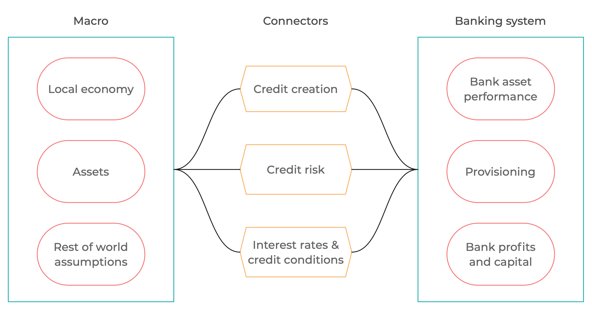
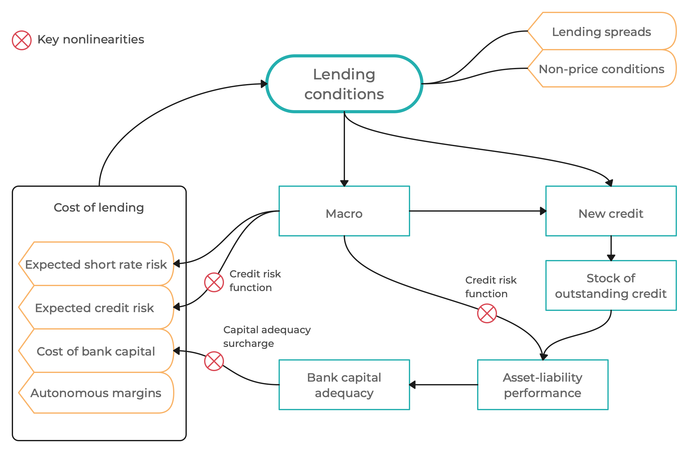

# Introduction and overview

![[title-page.md]]

--------------------------------------------------------------------------------

### What are we doing?

* Global Institute for Macroprudential Modeling [www.gimm.institute](https://www.gimm.institute): a
  (non-profit) networking organization for finstab and macropru
  practitioners

* Running regional and technical workshops

* Developing and implementing a finstab and macropru model framework

* Global macrofinancial scenario deliveries

--------------------------------------------------------------------------------

### What is the framework for?

* Big-picture aggregative description of two-way "behavioral" interactions between macro
  and the financial system with endogenous feedback

* Model based framework for scenario analysis

* Support for finstab scenario production and macropru policy analysis

* Top-layer complement to other existing models/tools

* Designed to help synthesize a variety of insights and inputs, including
  expert judgment

* Focus on medium-term time dimension of solvency risk (but flexible to
  judgmentally accommodate a range of other dimensions)

* Customizable and extensible to accommodate regional and jurisdictional
  specifics

--------------------------------------------------------------------------------

### What is the framework **not** meant to be?

* Forecasting framework 

* Formal probabilistic model or statistical prediction framework

* Deeply structural (aka DSGE) or "publishable" model

* Theory-based justification for macropru interventions

* Framework for (stress) testing individual institutions

--------------------------------------------------------------------------------

### Digression: Theoretical foundations

* A large amount of insights from our work on macropru DSGE models 

* Converted to semi-structural form

* Evolving form, based on our implementation expercience

--------------------------------------------------------------------------------

### Use cases and place in finstab and macropru

*After we see the structure of the model*

--------------------------------------------------------------------------------

### Basic structure of the framework

* Modular design (highly customizable) rather than fixed form

* The very basic model framework consists of three types of modules: macro,
  banking system, and connecting modules

* Examples of extension we implemented elsewhere: nonbank intermediaries (securities
  dealers), corporate fixed income markets, sovereign fixed income markets

--------------------------------------------------------------------------------

### Core feedback

--------------------------------------------------------------------------------

### Semi-structual modeling approach 

* **Top-down** model building strategy: the properties of the model as a whole
  matter and are frequently the starting point for writing equations

* Explicit (but not microfounded) concepts of **supply and demand**

* **Unobserved components**: sustainability trends both in macro and
  financial parts (potential output, credit to GDP, excess comfort buffers,
  etc.)

* Forward-looking (model-consistent) **expectations**
  * Help introduce some financial concepts consistently (e.g. IFRS9, pricing of future anticipated risk, etc.)
  * Help construct scnearios with expliciti assumptions about future events and their anticipation

* Well-behaved *8steady state** (steady growth path)

* Calibration heavily based on the properties of the model as **a whole
  system** ("smell test" simulations, policy trade-offs)

* Simplifying assumptions to mimic real word in an analytically tractable
  way (loan repayment schedule, present value calculations, asset valuation)

--------------------------------------------------------------------------------

### Operational flexibility

* Not a traditional econometric or research model with fixed form

* Needs to be maintained as a live evolving project, reacting to needs and
  questions arising over time

* Some equations and parameters may change as part of scenario assumptions

--------------------------------------------------------------------------------

### Typical use cases

1. Data-based projections, scenarios consistent with macroeconomic
   assumptions (e.g. central bank macro forecast) and the current state of
   the financial sector

1. Delta method to build scenarios on top of a baseline: consistent picture
   of shock impact on the macroeconomy and financial sector, taking into
   account the current state of the financial sector

1. Interpret historical/recent data (shocks, counterfactuals,
   unobservables)

1. Conceptual simulations, in particular policy interventions simulations,
   to recive insights as to how a particular policy impacts the financial
   sector and macroeconomy

--------------------------------------------------------------------------------

