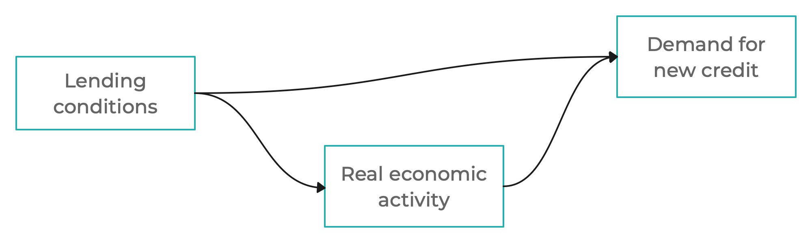
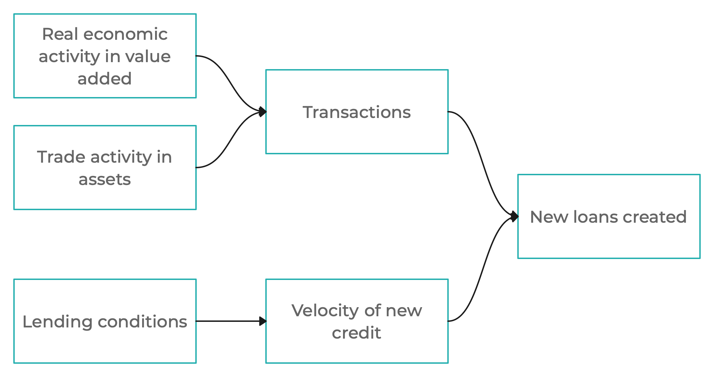

# Credit creation and deleveraging

![[title-page.md]]

$$
\def\xhspace{\hspace{0.05em}}
\def\xy{\mathit{y}}
\def\xpy{\mathit{py}}
\def\xnewl{\mathit{l\xhspace}^{\Delta}}
\def\xivy{\mathit{\imath vy\xhspace}}
\def\xtrn{\mathit{trn\xhspace}}
\def\xshock#1{\varepsilon_{#1}}
\def\xyfwl{\mathit{fwy}}
\def\xss{\mathrm{ss}}
\def\xtnd{\mathrm{tnd}}
\def\xlc{r^\mathrm{cond}}
\def\xl{\mathit{l}}
\def\xny{\mathit{ny}}
\notag
$$

## Overview

* Causality between Credit and Macroeconomic Activity

* Demand for New Credit

* Current Transactions and Inverse Velocity

* Deleveraging

## Causality between credit and macro activity

__Reduced-form approach__

Provides little insight into demand and supply forces in the credit market

 

__Semistructural approach__

Motivated by insights from DSGE models, provides more insight. Our approach

--------------------------------------------------------------------------------

## Lending conditions

Real-world lending conditions comprise

* price conditions: lending rates

* non-price conditions: collateral requirements, insurance requirements, quantitative rationing

In the model, the index of overall lending conditions is calculated as follows:

1. First, a hypothetical (unobservable) level of lending rates that would cover all lending costs and (expected) risks is calculated

2. This hypothetical level of full coverage lending rates is then split into price lending conditions (corresponding to the observed market lending rates) and non-price conditions (the remaining part)

3. The explicit price lending conditions determine the interest income in bank profits/losses

4. The total lending conditions (price and non-price) affect the choices made by real economic agents (households, non-financial businesses, etc.)

## Structure of credit creation process

--------------------------------------------------------------------------------

## Demand for new credit

New credit is demanded to finance current period's transactions

$$
\xnewl_t = \xivy_t \cdot \xtrn_t \cdot \exp \xshock{t,\,l\Delta}
$$

where

* $\xnewl_t$ is new credit
* $\xivy_t$ is the inverse velocity of new credit
* $\xtrn_t$ is the value of all the transactions that need financing
* $\xshock{t,\,l\Delta}$ is a shock to new credit

In the real world, current period's transactions are financed by combining new credit and money already existing (arising in credit creation in past
periods).

--------------------------------------------------------------------------------

## Current transactions

Current period nominal transactions comprise new value added (consumption,
investment, etc.) and trade in existing assets

$$
\xtrn_t = (1 - c_1) \cdot \xpy_t \cdot \xy_t\ +\ c_1 \cdot \xpy_t \cdot \xyfwl_t
$$

--------------------------------------------------------------------------------

## Inverse velocity of new credit

Process designed to stabilize the stock of bank loans to GDP ratio and
bring in the impact of lending conditions and other factors:

$$
\begin{aligned}
\xivy_t &= \xivy_{\xss} \\[5pt]
& - \ c_1 \cdot \xlc_t \\[5pt]
& + \ c_2 \cdot \left( \left[ \tfrac{\xl}{4\xny} \right]_t
\ -\ {\left[ \tfrac{\xl}{4\xny} \right]}_t^\xtnd \right) \\[5pt]
& + \ \xshock{t,\xivy}
\end{aligned}
$$

where

* $\xlc_t$ is a measure of lending conditions as defined in [[a5-interestRates.md]]

* $\left[ \tfrac{\xl}{4\xny} \right]_t - \left[ \tfrac{\xl}{4\xny} \right]_t^\xtnd$
  is the deviation of the credit to GDP ratio from its long-run sustainable
  trend

--------------------------------------------------------------------------------

## Deleveraging: Stocks and flows

Deleveraging is the process of reducing the amount of gross debt of
non-financial agents (households, businesses).

The stock of outstanding loans can only be reduced through reductions in
flows, i.e. new loans; simplified dynamics with no defaults and no foreign
currency denomination:

$$
\xl{t} = \left( 1 - \theta \right) \xl{t-1} + \xnewl_t
$$

Reductions in new loans are trigerred by tighter lending conditions and
(hence) a slowdown in real economic activity

---

